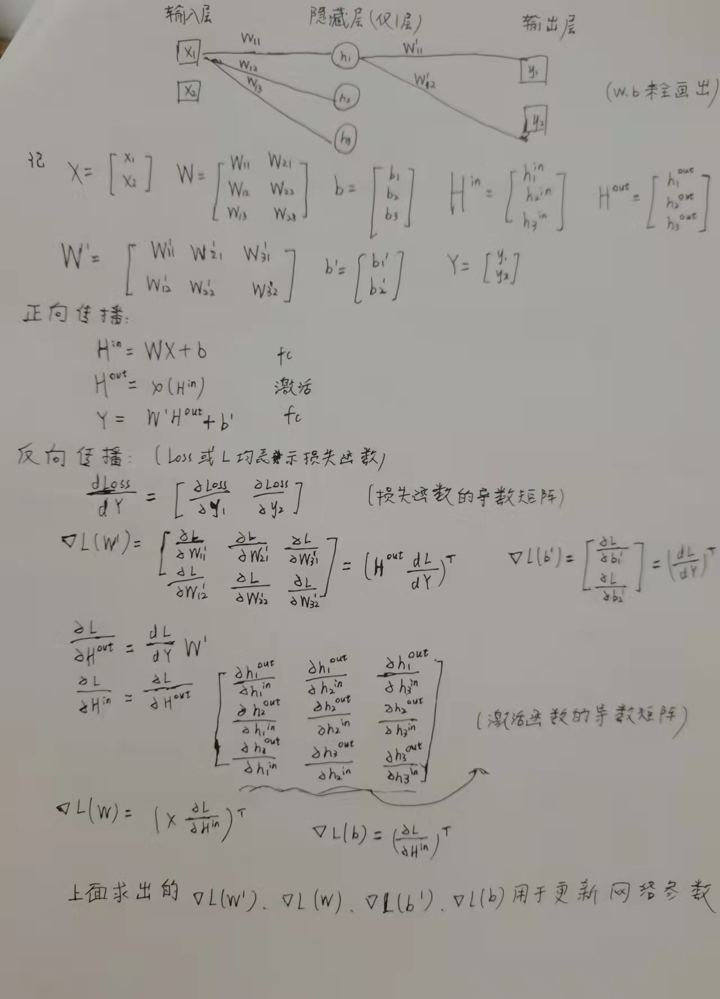
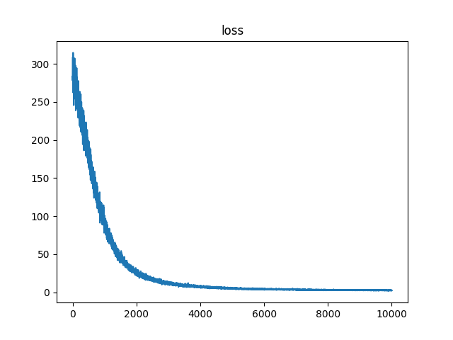

# FeedforwardNeuralNetwork
**手搓神经网络**

## 简介：

我的实习实训作业。利用numpy库手动实现了全连接BP神经网络。

ActivationMethods.py、LossMethods.py、FeedforwardNeuralNetwork.py共同实现了我的神经网络。

TestRegression.py调用了上述神经网络来拟合y=x²，作为检验。Results文件夹中保存了训练次数为10000时的训练、拟合结果。

## 环境：

python 3.8.10

## 实现原理：

核心思想是以层为单位进行矩阵的运算，先放一个简单的例子：

 

如上图：

正向传播时每一步由一个列向量进行矩阵运算得到一个新的列向量，每一步的列向量对应了一层各节点数值(含激活函数的层要区分输入输出)，这些列向量被缓存下来用于反向计算。

反向传播时每一步由一个行向量进行矩阵运算得到一个新的行向量，每一步的行向量对应了损失函数对某一层各节点的导数矩阵。层间传播时的行向量可用于计算参数的梯度矩阵，这样，参数同步更新，反向传播只保存当前得到的行向量即可。

上述讨论的是单样本情况，批量训练时会随机取多个样本并计算平均值来得到参数的梯度矩阵。我的思路是将正向传播和反向传播中的向量由二维扩展到三维，在最高维上重复相似的计算，具体实现时微调了损失函数、激活函数求导方法、权重矩阵与向量的矩阵乘法。

l2正则化是通过在参数更新时添加线性惩罚项实现的。

## 验证：

拟合y=x²，取样、调参、训练、测试详见代码

训练次数2000的拟合结果：

 

训练次数10000的拟合结果：

损失曲线：

